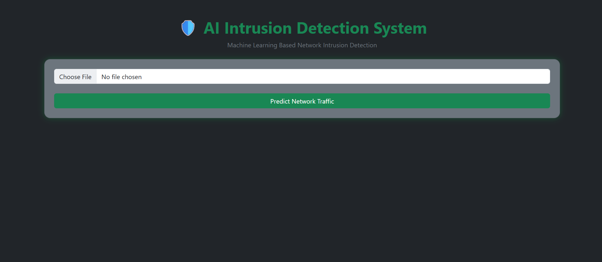
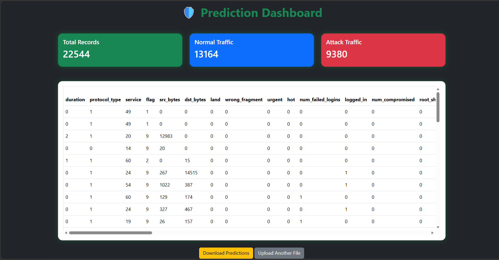
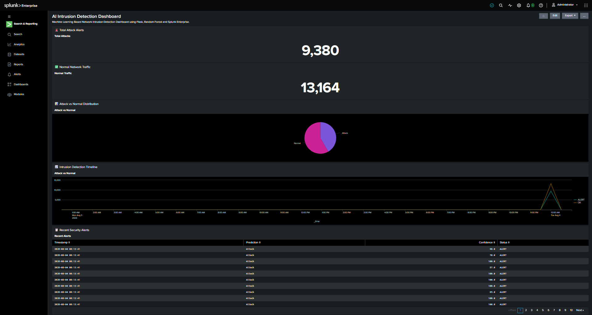

# 🛡️ AI Intrusion Detection System using Machine Learning & Splunk


An AI-powered **Network Intrusion Detection System (NIDS)** that uses a **Random Forest Machine Learning model** to classify network traffic as **Normal** or **Attack**. The project features a Flask-based web application, an interactive prediction dashboard, automated log generation, and **Splunk Enterprise SIEM** integration for security monitoring.

---

# 📚 Table of Contents

- Features
- System Architecture
- Workflow
- Tech Stack
- Dataset
- Installation
- Running the Project
- Screenshots
- Splunk Integration
- Project Report
- Future Improvements
- Author

---

# ✨ Features

- Machine Learning based Intrusion Detection
- Random Forest Classifier
- Flask Web Application
- Upload CSV Network Traffic
- Automatic Data Preprocessing
- Prediction Dashboard
- Confidence Score Generation
- Download Prediction Report
- Security Log Generation
- Splunk Enterprise Dashboard
- Interactive Charts
- Responsive UI

---

# 🏗️ System Architecture


---

# 🔄 Workflow

```
User
   │
   ▼
Flask Web Application
   │
   ▼
Upload Network Traffic CSV
   │
   ▼
Data Preprocessing
   │
   ▼
Random Forest Model
   │
   ├────────► Prediction Dashboard
   │
   └────────► Security Log Generator
                    │
                    ▼
            Splunk Enterprise SIEM
                    │
                    ▼
          SOC Monitoring Dashboard
```

---

# 💻 Tech Stack

### Programming

- Python

### Machine Learning

- Scikit-learn
- Random Forest

### Data Processing

- Pandas
- NumPy

### Backend

- Flask

### Frontend

- HTML
- CSS
- Bootstrap
- JavaScript
- Chart.js

### SIEM

- Splunk Enterprise

### Version Control

- Git
- GitHub

---

# 📂 Dataset

The project uses the **NSL-KDD Dataset** for training and testing.

Dataset files include:

- KDDTrain+
- KDDTest+

The dataset is preprocessed before being passed to the trained Random Forest model.

---

# ⚙️ Installation

Clone the repository

```bash
git clone https://github.com/underscores1109/AI-Intrusion-Detection.git
```

Go into the project folder

```bash
cd AI-Intrusion-Detection
```

Install dependencies

```bash
pip install -r requirements.txt
```

Run the Flask application

```bash
python app.py
```

Open your browser

```
http://127.0.0.1:5000
```

---

# 📸 Screenshots

## 🏠 Home Page



---

## 📊 Prediction Dashboard



---

## 🛡️ Splunk Enterprise Dashboard



---

# 📈 Splunk Integration

The application automatically generates structured security logs after every prediction.

These logs are imported into **Splunk Enterprise SIEM**, where they are visualized using dashboards showing:

- Total Attacks
- Normal Traffic
- Attack Distribution
- Security Timeline
- Recent Alerts

---

# 📄 Project Report

A detailed report covering:

- Introduction
- Literature Survey
- System Architecture
- Methodology
- Implementation
- Random Forest Algorithm
- Results
- Splunk Integration
- Future Scope

is available here:

📥 **[AI Intrusion Detection Project Report](docs/AI_Intrusion_Detection_Project_Report.pdf)**

---

# 🚀 Future Improvements

- Real-time Packet Capture
- Deep Learning Models (LSTM/CNN)
- Docker Deployment
- AWS Cloud Deployment
- Multi-Class Attack Detection
- Email Alert System
- REST API
- User Authentication
- Threat Intelligence Integration

---

# 👨‍💻 Author

**Bhargav Naidu S**

Cybersecurity Enthusiast

GitHub

https://github.com/underscores1109

LinkedIn

https://www.linkedin.com/in/bhargava-naidu-sasumanu-684329340/

---

⭐ If you found this project useful, consider giving it a Star.