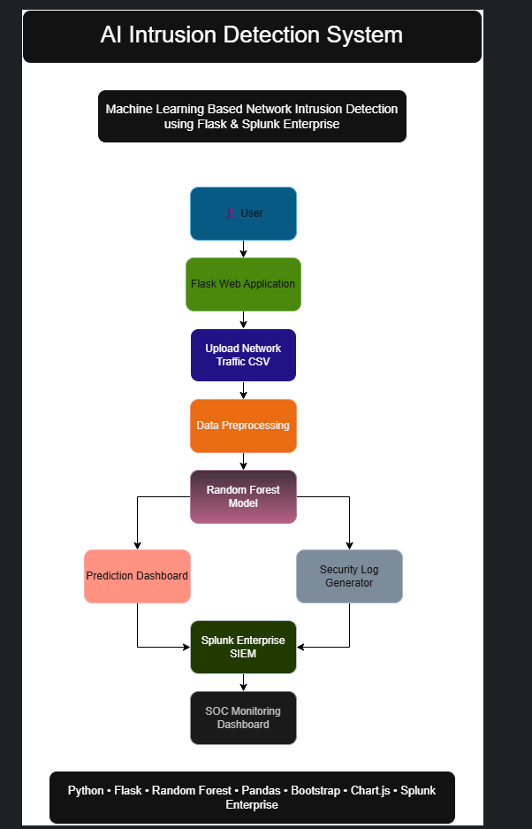

# 🛡️ AI Intrusion Detection System using Machine Learning & Splunk


An AI-powered **Network Intrusion Detection System (NIDS)** that uses a **Random Forest Machine Learning model** to classify network traffic as **Normal** or **Attack**. The project features a **Flask-based web application**, interactive dashboard, automated prediction reports, confidence scoring, and **Splunk Enterprise SIEM integration** for real-time intrusion monitoring.

---

# 📘 Table of Contents

- [Features](#-features)
- [System Architecture](#-system-architecture)
- [Workflow](#-workflow)
- [Tech Stack](#-tech-stack)
- [Dataset](#-dataset)
- [Machine Learning Model](#-machine-learning-model)
- [Splunk Integration](#-splunk-integration)
- [Installation & Usage](#-installation--usage)
- [Project Structure](#-project-structure)
- [Results](#-results)
- [Screenshots](#-screenshots)
- [Future Enhancements](#-future-enhancements)
- [Author](#-author)

---

# 🚀 Features

- 📂 Upload Network Traffic CSV Files
- 🤖 AI-powered Intrusion Detection
- 🌲 Random Forest Classifier
- 📊 Confidence Score Generation
- 📈 Interactive Dashboard
- 📉 Pie & Bar Chart Visualizations
- 📋 Prediction Summary Cards
- 📥 Download Prediction Reports
- 📝 Automatic Security Log Generation
- 🛡️ Splunk Enterprise SIEM Dashboard
- ⚡ Real-Time Intrusion Monitoring

---

# 🏗️ System Architecture



> The system integrates machine learning, Flask, and Splunk Enterprise into a unified intrusion detection pipeline capable of detecting malicious network traffic and generating security monitoring dashboards.

---

# 💡 Workflow

1. Upload Network Traffic CSV
2. Flask receives the dataset
3. Data preprocessing is performed
4. Random Forest predicts traffic type
5. Confidence scores are generated
6. Dashboard displays results
7. Prediction report is generated
8. Security logs are created
9. Splunk Enterprise visualizes intrusion events

---

# 🧩 Tech Stack

| Layer | Technology |
|--------|------------|
| Frontend | HTML, CSS, Bootstrap |
| Backend | Flask |
| Programming Language | Python |
| Machine Learning | Scikit-Learn |
| ML Algorithm | Random Forest |
| Data Processing | Pandas, NumPy |
| Visualization | Chart.js |
| Dataset | NSL-KDD |
| SIEM | Splunk Enterprise |
| Version Control | Git & GitHub |

---

# 📂 Dataset

**Dataset Used:** NSL-KDD

The NSL-KDD dataset is an improved version of the KDD Cup 1999 dataset designed for evaluating intrusion detection systems.

It contains:

- Normal Traffic
- DoS Attacks
- Probe Attacks
- R2L Attacks
- U2R Attacks

---

# 🤖 Machine Learning Model

Algorithm Used:

**Random Forest Classifier**

### Performance

| Metric | Score |
|---------|-------|
| Accuracy | **99.96%** |
| Precision | **1.00** |
| Recall | **1.00** |
| F1-Score | **1.00** |

---

# 🛡️ Splunk Integration

The application automatically generates security logs after every prediction.

Generated Log Fields:

- Timestamp
- Prediction
- Confidence
- Status

The logs are indexed into **Splunk Enterprise** to create a SIEM dashboard featuring:

- 🚨 Total Attack Alerts
- ✅ Normal Network Traffic
- 📊 Attack vs Normal Distribution
- 📈 Intrusion Detection Timeline
- 📋 Recent Security Alerts

---

# ⚙️ Installation & Usage

```bash
git clone https://github.com/underscores1109/AI-Intrusion-Detection.git

cd AI-Intrusion-Detection

python -m venv venv

venv\Scripts\activate

pip install -r requirements.txt

python app.py
```

Open:

```
http://127.0.0.1:5000
```

Upload a CSV file and start intrusion detection.

---

# 📁 Project Structure

```text
AI-Intrusion-Detection/
│
├── dataset/
├── logs/
├── models/
├── outputs/
├── screenshots/
├── src/
├── static/
├── templates/
├── uploads/
├── app.py
├── requirements.txt
└── README.md
```

---

# 📈 Results

✔ Model Accuracy: **99.96%**

✔ Real-Time Intrusion Detection

✔ Confidence Score Generation

✔ Downloadable Prediction Reports

✔ Splunk Enterprise Dashboard

✔ Automated Security Log Generation

---

# 📸 Screenshots

## 🏗️ System Architecture


---

## 🏠 Home Page


---

## 📊 Prediction Dashboard


---

## 🛡️ Splunk Enterprise Dashboard


---

# 🚀 Future Enhancements

- Deep Learning-Based Intrusion Detection
- Real-Time Packet Capture
- Live Network Monitoring
- Email & SMS Alert System
- Docker Deployment
- REST API Integration
- Cloud Deployment (AWS/Azure)
- Multi-Class Attack Classification

---

# 👨‍💻 Author

## Bhargav Naidu

🎓 B.Tech – Computer Science (Cyber Security)

🛡️ Aspiring SOC Analyst | Passionate about Cybersecurity, AI, Machine Learning, and SIEM Technologies.

### 📧 Connect with Me

**GitHub**

https://github.com/underscores1109

**LinkedIn**

https://www.linkedin.com/in/bhargava-naidu-sasumanu-684329340/

---

⭐ If you found this project useful, consider giving it a **Star** on GitHub!
